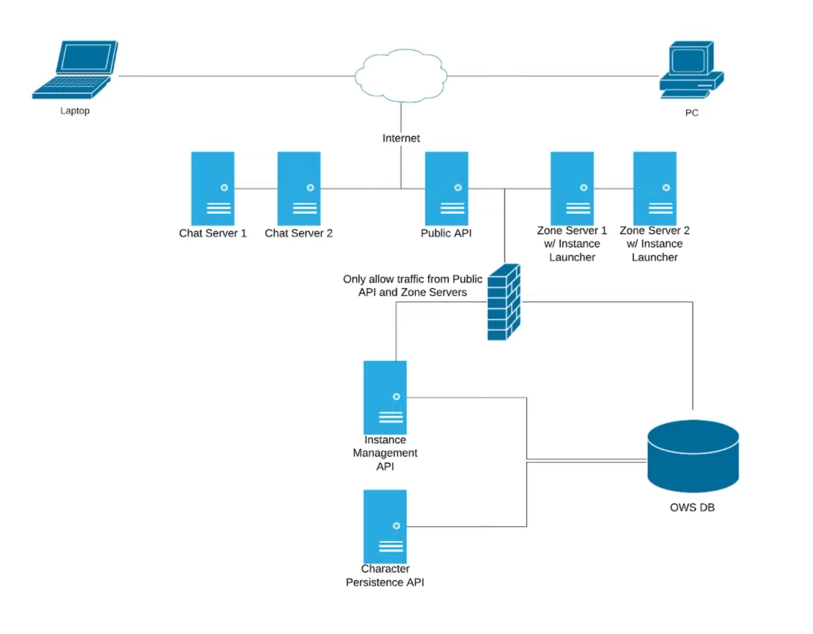
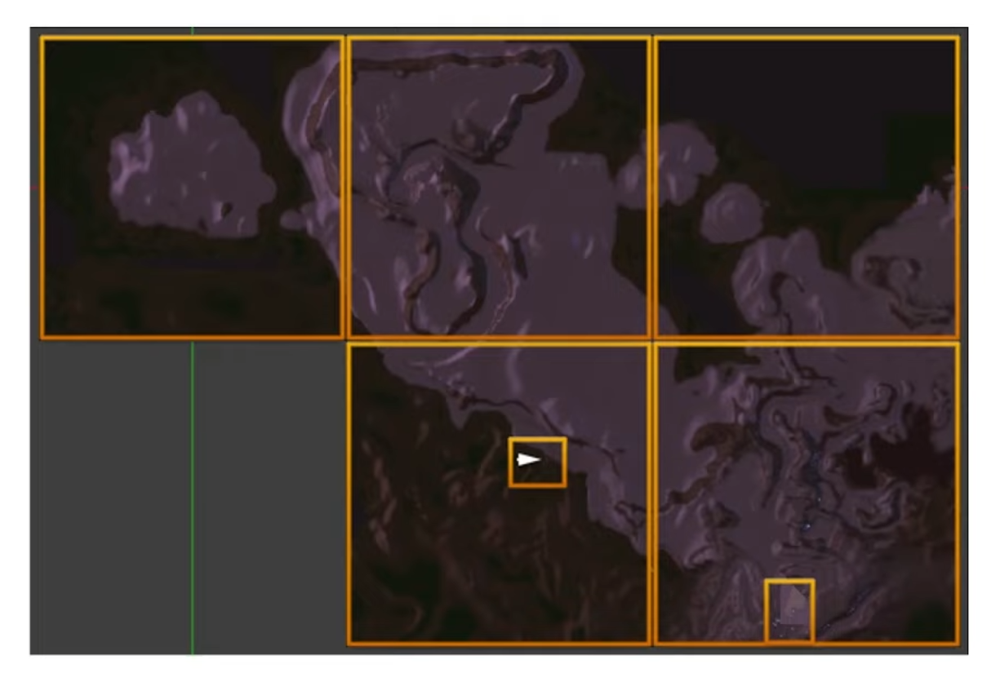

# Getting Started
Here is a brief overview of OWS 2.

## Why OWS 2?
* The primary goal of OWS 2 is to increase scalability and achieve a higher concurrent player count for your online multiplayer game. With OWS 2 our goal is to scale beyond **100,000** concurrent players.
* OWS 1 was difficult to install in a local development environment for developers without specific technical knowledge. With OWS 2 and Docker, setup in your local development environment is quick and easy. By running OWS 2 locally, you can customize the API to meet your needs. 
* OWS 1 required Windows and Windows Servers. OWS 2 runs natively on **Windows**, **Linux** and **MacOS**.

## What technologies / architecture does OWS 2 use?
* The OWS Web API is developed in **C#** with **.NET 8** (previously .NET Core)
* The default storage technology is [Microsoft SQL Server (MSSQL)](mssql)
  * Each repository can use its own storage technology
  * [Storage technologies](setup-database) can be easily added by implementing each repository interface
* Microservices allow OWS to scale more easily
* Dependency injection
  * Easily plug-in various implementations to support different services and technologies
* [Docker](docker-setup) for one click deployment on your local development PC
  * Docker runs all OWS servers in containers
  * OWS can run with or without Docker
* [Unreal Engine](https://www.unrealengine.com/)
  * OWS 2 uses Unreal Engine's powerful server architecture as a base to dynamically spin up servers as they are needed to populate your game world

## OWS Network Diagram
{: .mt-3}

## Zones & Shards
{: .mt-3}
* Zones represent an Unreal Engine map or area of an Unreal Engine map that a single Unreal Engine server controls
* Unreal Engine maps can be split up into multiple zones and zones can have multiple shards
* By splitting your world into zones and then sharding those zones, you can achieve the concurrent player count your game requires
* Players in different zones and shards of zones can only see or interact with players in the same zone or shard

### Zone servers & zone server instances
* Zone servers are hardware devices (servers) that are designated to run Zone Server Instances
* One or more Zone Servers can be registered with OWS
* A Zone Server Instance is an Unreal Engine Server Instance
* A Zone Server can run one or multiple Zone Server Instances
* A Zone Server Instance can represent an Unreal Engine map or a section of an Unreal Engine map
* More than one Zone Server Instance can be run per Zone (shards) to allow more players in that Zone
* A Zone Server Instance can be configured with a Soft Player Cap and a Hard Player Cap. New shards are spun up when the Soft Player Cap is met.
