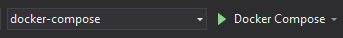

# Docker Setup

## Requirements  
* Download or clone [OWS](https://github.com/Dartanlla/OWS)
* Download and install [Visual Studio 2022 Community](https://visualstudio.microsoft.com/downloads/)
  * The ASP.NET and Web Development, Node.js Development, and Game development with C++ workloads are required
* Download and install [Docker Desktop](https://www.docker.com/products/docker-desktop) for Windows/macOS/Linux
* [.Net 8.0 SDK](https://dotnet.microsoft.com/en-us/download/dotnet/8.0)
* Enable "Virtualization Technology" in your BIOS
<br />
<br />

<details open markdown="block">
  <summary class="fs-6 mb-3">
    Windows
  </summary>

1. Make sure Windows Subsystem for Linux is installed. {: .mt-3}  
2. Download and install [Docker Desktop for Windows](https://www.docker.com/products/docker-desktop)
3. Open OWS Project in Visual Studio 2022 Community. The [ASP.NET and Web Development workload](../troubleshooting/visual-studio#installing-workloads) is required. The "Node.js development" workload is also required for the Vue.js build process.  If you plan to use Unreal Engine, you will also need to install the "Game development with C++" workload.
4. Select Docker Compose startup project and Launch Docker Compose. {: .mt-3}
5. <span class="label" style="margin-left: -3px">Optional</span>  
   Running Docker Compose without Visual Studio Debugger, Enter the following Command Prompt from the OWS root directory.

   ```bash
   docker-compose -f docker-compose.yml -f docker-compose.override.windows.yml -f docker-compose-additional.yml up -d 
   ```

   For a fresh build use the following command
   
   ```bash
   docker-compose -f docker-compose.yml -f docker-compose.override.windows.yml -f docker-compose-additional.yml up -d --build --force-recreate 
   ```
</details>

<details markdown="block">
  <summary class="fs-6 mb-3">
    macOS
  </summary>

1. Download and install [Docker Desktop for Mac](https://docs.docker.com/desktop/install/mac-install/)
2. Open OWS Project in [Visual Studio For Mac](https://visualstudio.microsoft.com/de/vs/mac/). The [ASP.NET and Web Development workload](../troubleshooting/visual-studio#installing-workloads) is required.
3. Run the following command in a terminal to install the Development Certificates
   
   ```bash
   dotnet dev-certs https --trust
   ```

4. Select Docker Compose startup project and Launch Docker Compose. {: .mt-3}
5. <span class="label" style="margin-left: -3px">Optional</span>  
    Running Docker Compose without Visual Studio Debugger, Run the following command in an terminal from the OWS root directory.

   ```bash
   docker-compose -f docker-compose.yml -f docker-compose.override.osx.yml -f docker-compose-additional.yml up -d 
   ```

   For a fresh build use the following command
   
   ```bash
   docker-compose -f docker-compose.yml -f docker-compose.override.osx.yml -f docker-compose-additional.yml up -d --build --force-recreate 
   ```
</details>

<details markdown="block">
  <summary class="fs-6 mb-3">
    Linux
  </summary>

1. Download and install [Docker Desktop for Linux](https://docs.docker.com/desktop/install/linux-install/)
2. Close all web browsers
3. Download and Run [dotnet-dev-certificate-linux](https://github.com/CodewareGames/dotnet-dev-certificate-linux) to install Development HTTPS Certificate.
4. Run the following command in an terminal from the OWS src directory.

   ```bash
   sudo docker-compose -f docker-compose.yml -f docker-compose.override.linux.yml -f docker-compose-additional.yml up -d 
   ```

   For a fresh build use the following command

   ```bash
   sudo docker-compose -f docker-compose.yml -f docker-compose.override.linux.yml -f docker-compose-additional.yml up -d --build --force-recreate 
   ```
</details>

[Next: Database setup](setup-database){: .btn .btn-outline }
