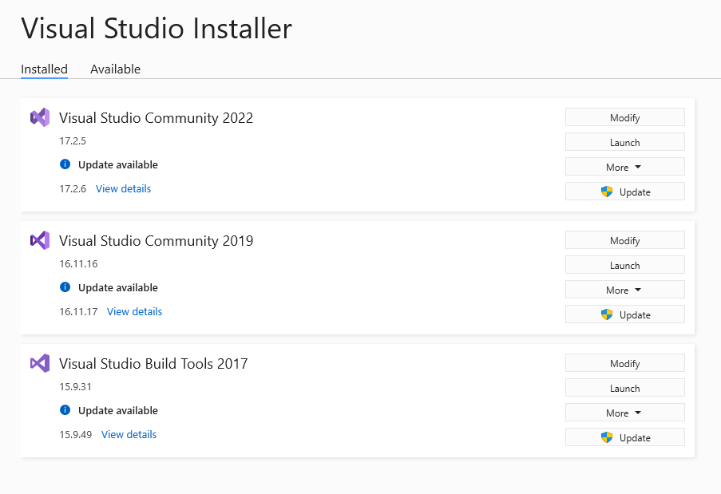
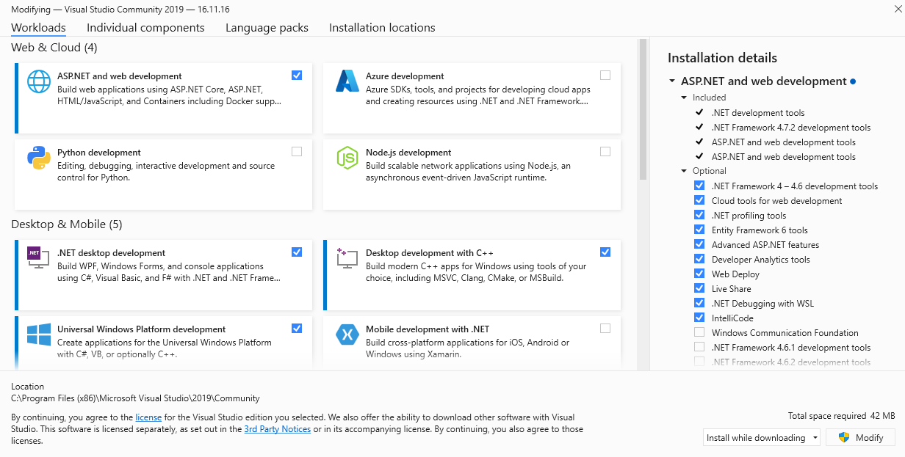

# Visual Studio

Got problems setting up Visual Studio or did you run into any problems related to Visual Studio while following the OWS installation steps? This section should help you troubleshoot those problems.

## Installing workloads

Make sure that you installed at least the ASP.NET and Web Development workloads for your Visual Studio version.

1. Open **Visual Studio Installer** which should've been installed together with Visual Studio
2. In the **installed** section find the card with your current Visual Studio version and click on **Modify** {: .mt-3}
3. In the upcoming dialog make sure that inside the **Workloads** section at least the **ASP.NET** and **Web Development** workloads are checked. If not, check them now and then click on **Modify** located in the bottom right corner to install the missing workloads. {: .mt-3}